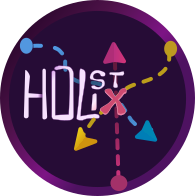

<div align="center">
  <a href="https://holistix.so" target="_blank" rel="noopener noreferrer">
    
  </a>
  <br>
  <br>
  <a href="https://holistix.so" target="_blank" rel="noopener noreferrer">holistix.so</a>
  <br>
  <br>
</div>

# Holistix Forge : Platform

> **The Integration Backbone That Exponentializes Your Team Potential**

Stop switching between apps. Stop losing context in email threads. Stop compromising with tools that don't fit your workflow. **Holistix Forge** unifies your entire tool stack—SaaS, containers, cloud, on-premise—into one collaborative platform where modular UI components become LEGO blocks for your perfect interface.

<div align="center">
  
</div>

## 🎯 What Makes Holistix Forge Different?

### 🧩 Modular UI Assembly: LEGO Blocks for Apps

Unlike traditional platforms that lock you into rigid interfaces, Holistix Forge provides **modular UI components from integrated apps as reusable LEGO blocks**. Modules plug into the platform, each providing UI components from different applications. Place the data visualization component from JupyterLab, the form builder from Notion, the collaboration features from Airtable—exactly where they make sense in your workflow. **Build your perfect interface, assembled from the best parts of all your tools.**

### 💬 Contextual Communication, Not Dead Data Silos

Traditional communication tools create separate silos—email threads and chat apps that exist apart from your work, losing context and creating friction. Holistix Forge's **cross-tool communication** embeds conversations directly within your project context. Have discussions within specific documents, linked to particular data points, attached to components, or connected to any part of your project graph. **The conversation lives where your work lives**—not in separate email threads or chat apps that disconnect from your actual work.

### 🧠 Complete AI Context: Exponential Intelligence

By consolidating all project data—requirements, designs, code, tests, containers, communications, processes—into one unified graph, Holistix Forge gives AI agents **complete project context**. Instead of working with isolated files or fragments, AI can understand relationships, trace dependencies, analyze impact, and provide intelligent automation based on the complete picture. **When AI has the full context, it becomes exponentially more effective.**

### 📊 Graph-Based Data Model: Projects Aren't Folders

Projects aren't folders—they're interconnected graphs of requirements, designs, implementations, and tests. Holistix Forge uses a **graph-based data model** that naturally represents how complex projects actually work. Navigate relationships, discover connections, and visualize your entire project as a living, interconnected system. **The data structure matches how complex projects actually work.**

### 🔄 Real-Time Collaboration Without Conflicts

Multiple team members can edit simultaneously without fear of conflicts or data loss. Powered by **YJS CRDT technology**, changes propagate instantly across all connected clients. Collaboration happens naturally, as if you're working side-by-side. **See changes instantly, work together seamlessly.**

### 🐳 Containerized Applications, Simplified

Deploy JupyterLab, pgAdmin, n8n, VSCode Server, or any custom containerized application with **one click**. Each gets a stable, bookmarkable URL that persists across infrastructure changes. Automatic VPN networking, OAuth2 authentication, and seamless integration into your workspace. **No more broken bookmarks or manual port management.**

### ✅ Formal Process Checking: Quality Without the Overhead (upcoming)

Define formal quality assurance processes using process description languages. Holistix Forge automatically checks that processes are followed, detects deviations, generates compliance reports, and ensures traceability—**all without manual overhead**. Preserve the value of rigorous QA processes (ISO-9001, DO-178, MIL-STD, etc.) while eliminating the effort.

### And more coming (credentials wallet, virtual file system)...

## 🚀 Quick Start

### Local Development

```bash
# Clone the repository
git clone https://github.com/HolistixForge/platform.git
cd platform

# Install dependencies
npm install

# See comprehensive setup guide
👉 doc/guides/LOCAL_DEVELOPMENT.md
```

### Production Deployment

```bash
# See architecture documentation
👉 doc/architecture/OVERVIEW.md
```

## 🎨 Core Features

- **🧩 Modular Architecture** - UI components from integrated apps as reusable LEGO blocks
- **💬 Cross-Tool Communication** - Conversations embedded in your work context, not separate silos
- **🧠 Complete AI Context** - Full project context for exponential AI effectiveness
- **📊 Graph-Based Workspace** - Visual whiteboard with nodes, connections, and real-time collaboration
- **🔄 Real-Time Collaboration** - YJS CRDT for conflict-free simultaneous editing
- **🐳 Container Management** - Deploy and manage containerized apps with stable URLs
- **🔐 Unified Authentication** - OAuth2 provider for seamless access across all integrated tools
- **👥 Multi-Tenant Organizations** - Organization and project scoping with fine-grained permissions
- **✅ Formal Process Checking** - Automated QA and compliance without manual overhead
- **🔌 Integration Backbone** - Connect SaaS, cloud, on-premise, and containerized tools

## 🏗️ Architecture

See [doc/architecture/OVERVIEW.md](doc/architecture/OVERVIEW.md) for detailed architecture.

## 📚 Documentation

**Main Hub:** [doc/README.md](doc/README.md)

**Quick Links:**

- 🏗️ [Architecture Overview](doc/architecture/OVERVIEW.md)
- 🚀 [Local Development](doc/guides/LOCAL_DEVELOPMENT.md)
- 📖 [API Reference](doc/reference/API.md)

## 🎯 Use Cases

**Perfect for:**

- 🛠️ **Engineering Teams** - From requirements to deployment, all in one workspace
- 📊 **Data Science Teams** - Collaborative notebooks, data pipelines, and model deployment
- 🔬 **Research Teams** - Manage experiments, data analysis, and publications
- 👥 **Cross-Functional Teams** - Break down silos, connect disciplines
- 🏢 **DevOps Teams** - Infrastructure as collaborative data, container orchestration
- 🎓 **Academic Teams** - Collaborative research workflows and project management

## 🤝 Contributing

We welcome contributions! See [CONTRIBUTING.md](CONTRIBUTING.md) for development workflow, coding standards, and contribution guidelines.

## 📄 License

Holistix Forge is licensed under the **[GNU Affero General Public License v3.0](LICENSE)** (AGPL-3.0).

This is a strong copyleft license that:

- ✅ Allows commercial use, distribution, modification, and private use
- ✅ Provides an express grant of patent rights from contributors
- ⚠️ Requires disclosure of source code when distributing the software
- ⚠️ Requires that modified versions used over a network must make source code available
- ⚠️ Requires derivative works to be licensed under the same terms

**Key Points:**

- You are free to use, modify, and distribute this software
- If you modify this software and provide it as a service over a network, you must make your modified source code available
- All derivative works must also be licensed under AGPL-3.0

## 🙋 Support

- **Documentation:** [doc/README.md](doc/README.md)
- **Issues:** [GitHub Issues](https://github.com/HolistixForge/platform/issues)
- **Discussions:** [GitHub Discussions](https://github.com/HolistixForge/platform/discussions)

---

**Stop switching between apps. Stop losing context. Stop compromising. Build your perfect tool from modular UI components. Experience Holistix Forge.**
